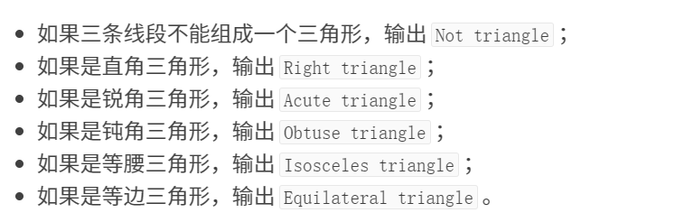
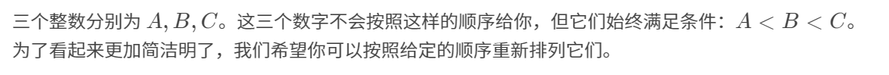

# [第一次作业](https://www.luogu.com.cn/contest/134029)题解

## P5717 【深基3.习8】三角形分类

### 思路

考的是`if()`的使用,还要给三条边判断大小


判断优先级：
- 三角形？
- 直角、钝角、锐角
- 等腰
- 等边


判断按题给顺序来

### 代码
```c
#include <stdio.h>
int main()
{
    int a = 0, b = 0, c = 0, x = 0, y = 0, z = 0;
    scanf("%d %d %d", &a, &b, &c);
    x = (a < b ? a : b) < c ? (a < b ? a : b) : c; 
    z = (a > b ? a : b) > c ? (a > b ? a : b) : c;
    y = a + b + c - x - z;

    if (x + y <= z) 
    {
        printf("Not triangle\n");
    }
    else 
    {
        if (x * x + y * y == z * z) printf("Right triangle\n");
        else if (x * x + y * y > z * z) printf("Acute triangle\n");
        else if (x * x + y * y < z * z) printf("Obtuse triangle\n");

        if(x == y || y == z || x == z)  printf("Isosceles triangle\n");

        if(x == y && y == z)  printf("Equilateral triangle\n");
    }

    return 0;
}
```

## P5714 【深基3.例7】肥胖问题

### 思路

数据类型用`double`


先计算，后判断，超重要多输出个`BMI`


看着麻烦，刚开始把我也唬住了

其实用`%g`就好了，涨知识了（参考群里《C Primer Plus》表4.3）


## 代码
```c
#include <stdio.h>
int main()
{
    double m = 0, h = 0, bmi = 0;
    scanf("%lf %lf", &m, &h);
    bmi = m / (h * h);

    if (bmi < 18.5) printf("Underweight\n");
    else if (bmi >= 24) printf("%.6g\nOverweight\n", bmi);
    else printf("Normal\n");

    return 0;
}
```

## P1422 小玉家的电费

## 思路

对用电量判断，最后保留一位小数
## 代码
```c
#include <stdio.h>
int main()
{
    double a = 0, ans = 0;
    scanf("%lf", &a);

    if (a <= 150) ans = a * 0.4463;
    else if (a >= 151 && a <= 400) ans =  150 * 0.4463 + (a - 150) * 0.4663;
    else ans =  150 * 0.4463 + 250 * 0.4663 + (a - 400) * 0.5663;

    printf("%.1lf", ans);

    return 0;
}
```

## P4414 [COCI2006-2007#2] ABC

## 思路

先比大小，得出ABC

ABC、ACB、BAC、BCA、CAB、CBA六种情况，不用字符串也可以，就麻烦一点

## 代码
```c
#include <stdio.h>
int main()
{
    int a = 0, b = 0, c = 0, A = 0, B = 0, C = 0;
    char x = 0, y = 0, z = 0;
    scanf("%d %d %d", &a, &b, &c);
    scanf("\n%c%c%c", &x, &y, &z);

    A = (a < b ? a : b) < c ? (a < b ? a : b) : c; 
    C = (a > b ? a : b) > c ? (a > b ? a : b) : c;
    B = a + b + c - A - C;

    if (x == 'A' && y == 'B' && z =='C') printf("%d %d %d", A, B, C);
    else if (x == 'A' && y == 'C' && z =='B') printf("%d %d %d", A, C, B);
    else if (x == 'B' && y == 'A' && z =='C') printf("%d %d %d", B, A, C);
    else if (x == 'B' && y == 'C' && z =='A') printf("%d %d %d", B, C, A);
    else if (x == 'C' && y == 'B' && z =='A') printf("%d %d %d", C, B, A);
    else if (x == 'C' && y == 'A' && z =='B') printf("%d %d %d", C, A, B);

    return 0;
}
```

## P1909 [NOIP2016 普及组] 买铅笔

## 思路

- 每种的情况要买几包
- 每种情况的价钱
- 找出最优解

## 代码
```c
#include <stdio.h>
int main()
{
    int n = 0, n1 = 0, v1 = 0, n2 = 0, v2 = 0, n3 = 0, v3 = 0;
    int x = 0, y = 0, z = 0, ans = 0;
    scanf("%d %d %d %d %d %d %d", &n, &n1, &v1, &n2, &v2, &n3, &v3);

    if (n % n1 == 0) x = (n / n1) * v1;
    else x = (n / n1 + 1) * v1; 

    if (n % n2 == 0) y = (n / n2) * v2;
    else y = (n / n2 + 1) * v2; 

    if (n % n3 == 0) z = (n / n3) * v3;
    else z = (n / n3 + 1) * v3; 

    ans = (x < y ? x : y) < z ? (x < y ? x : y) : z;

    printf("%d", ans);
    return 0;
}
```

## 写在后面
洛谷题确实有点难度，不过再难也是基础题。加油吧，少年！
也可以试试[C语言网](https://www.dotcpp.com/oj/train/)的题集，更基础一点

晚安